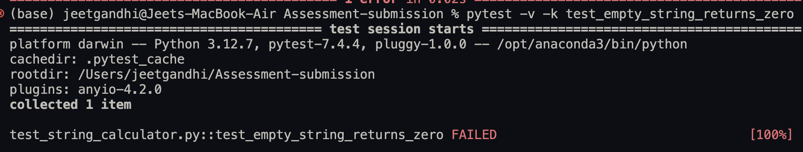
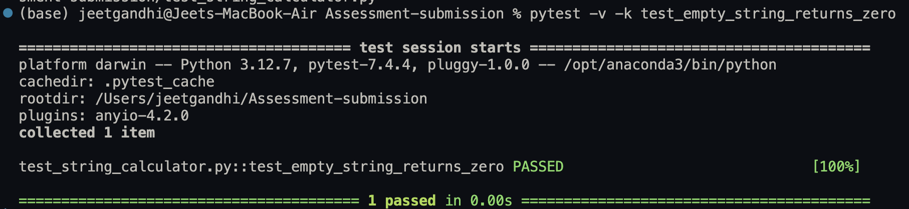
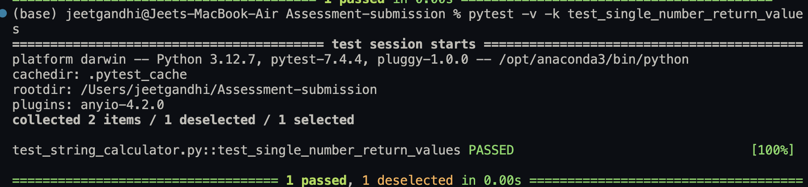
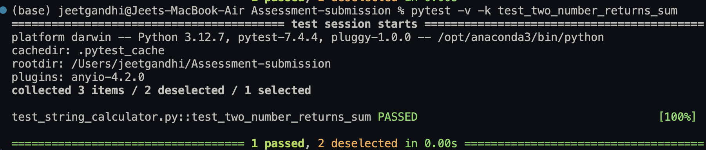
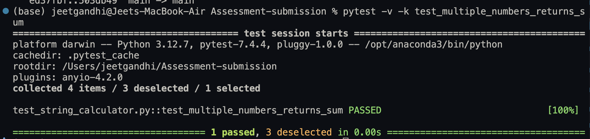
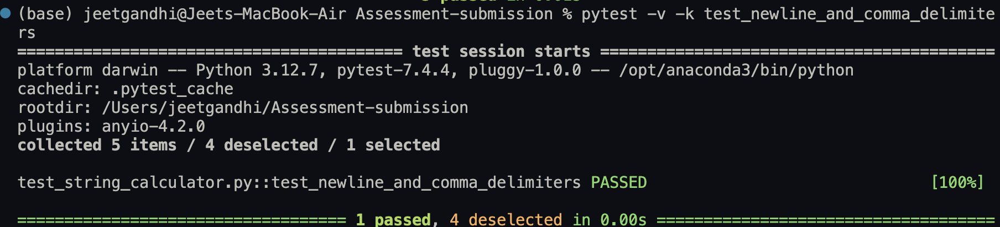
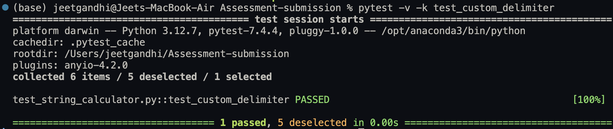
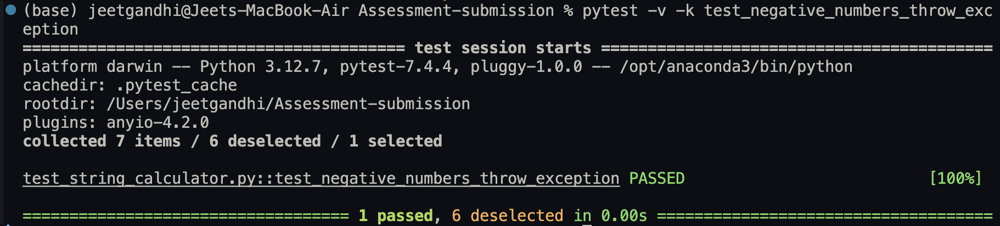
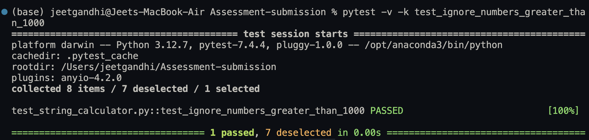
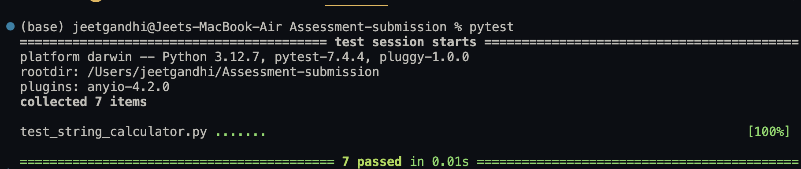

# 🧪 String Calculator TDD - Incubyte Assessment

This project is a TDD-based implementation of the String Calculator Kata, completed as part of the Incubyte recruitment process.

---

## 📌 Problem Statement

Create a function `add(string numbers)` that takes a string of numbers separated by delimiters and returns their sum. The implementation follows strict TDD (Test-Driven Development) principles.

---

## ⚙️ Tech Stack

- **Language:** Python 3
- **Testing Framework:** pytest
- **Methodology:** Test Driven Development (TDD)
- **Tooling:** Visual Studio Code, Git, GitHub

---

## ✅ Features Implemented

- Return `0` for an empty string
- Return the number itself for a single numeric input
- Sum two comma-separated numbers (e.g., `"1,2"` → `3`)
- Sum any number of comma-separated values
- Support newline (`\n`) as a valid delimiter
- Support custom single-character delimiters using the syntax `//[delimiter]\n[numbers...]`
- Raise an exception for negative numbers and list all of them in the error message
- Ignore numbers greater than 1000
- Support multiple custom delimiters using syntax like `//[***][%]\n1***2%3`

---

## 📁 Project Structure

<pre>
Assessment-submission/
├── string_calculator.py        # Logic implementation for add()
├── test_string_calculator.py   # Unit tests using pytest
├── README.md                   # Project documentation (this file)
├── screenshots/                # Screenshots of test runs and structure
│   ├── test_empty_string_returns_zero_fail_test.png
│   ├── test_empty_string_returns_zero.png
│   ├── test_single_number_returns_value.png
│   ├── test_two_numbers_return_sum.png
│   ├── test_multiple_numbers_return_sum.png
│   ├── test_newline_and_comma_delimiter.png
│   ├── test_custom_single_character_delimiter.png
│   ├── test_negative_numbers_raise_exception.png
│   ├── test_ignore_numbers_greater_than_1000.png
│   ├── test_multiple_custom_delimiters.png
│   └── all_test_passed.png
</pre>

---

## ▶️ How to Run

1. Make sure Python is installed.
2. Install `pytest` if not already installed:
   ```bash
   pip install pytest

---

## 📸 Test Result Screenshots

### ❌ Initial Failing Test

- [](screenshots/test_empty_string_returns_zero_fail_test.png)

---

### ✅ Passed Test Cases

- [](screenshots/test_empty_string_returns_zero.png)
- [](screenshots/test_single_number_returns_value.png)
- [](screenshots/test_two_numbers_return_sum.png)
- [](screenshots/test_multiple_numbers_return_sum.png)
- [](screenshots/test_newline_and_comma_delimiter.png)
- [](screenshots/test_custom_single_character_delimiter.png)
- [](screenshots/test_negative_numbers_raise_exception.png)
- [](screenshots/test_ignore_numbers_greater_than_1000.png)

---

### ✅ Final Confirmation

- [](screenshots/all_test_passed.png)